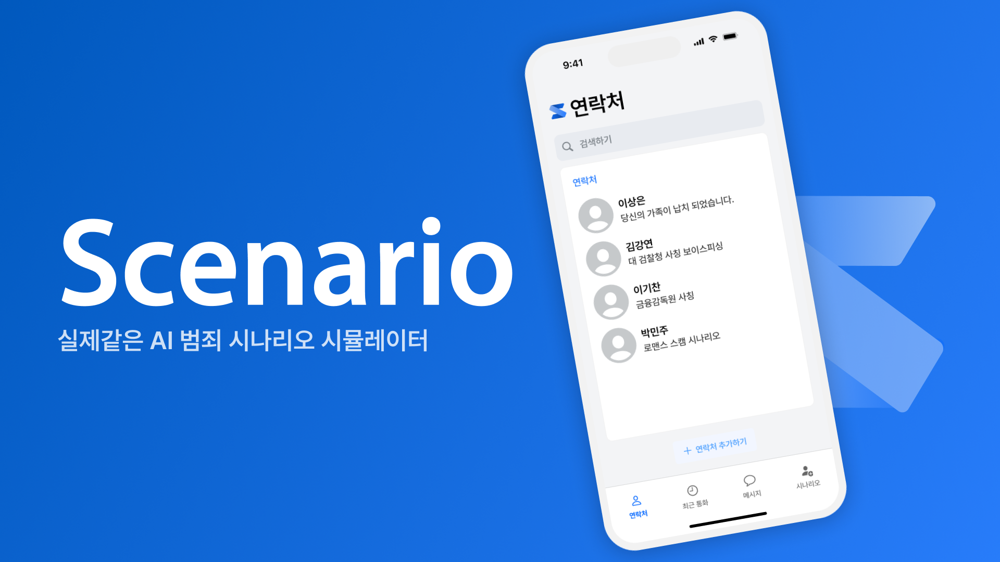

# 시나리오 - 실제같은 AI 범죄 시나리오 시뮬레이터
**시나리오**는 AI 기술을 이용하여 사용자에게 보이스피싱 및 기타 범죄 상황을 체험하게 하여 예방 교육을 제공합니다. 

## 개발동기
요즘에는 젊은 사람들도 보이스피싱에 피해를 받을 만큼 날이 갈수록 보이스피싱 범죄가 진화하고 있습니다. 
팀원 중 보이스피싱 피해를 받아 자산 피해를 받은 사례가 있기에, 보이스피싱은 어느 누구에게나 일어날 수 있는 일이라 생각하였습니다. 
이런것을 예방 할 만한 방법이 있을까 고민중 보이스피싱을 예방을 글로만 하는 것이 아닌 사용자에게 실제와 유사한 범죄 상황을 체험하게 하여 경각심을 높이고, 올바른 대처 방법을학습하는것을 생각 하였습니다. 
그래서 보이스피싱 예방 시뮬레이션 **시나리오**를 개발하게 되었습니다.

## 주요 기술 스택
**Front-End (APP):** Swift, SwiftUI, CallKit, Alamofire, UIKit, SwiftAudio 
**Back-End (API):** Kotlin, Spring Boot 
**Back-End (AI):** Python, FastAPI, OpenAI 
**Database:** Spring Data JPA, Sqlalchemy, MySQL, Redis, Mongo DB 
**Cloud:** Google Cloud Computer Engine, AWS EC2 & S3, Docker

## 주요 기능
**1. 전화 시뮬레이션:** 생성형 AI와 TTS서비스 타입캐스트와의 협업을 통해 더욱 다양한 목소리로 더욱 실제 같은 시뮬레이션을 제공합니다. 
**2. 메시지 시뮬레이션:** 생성형 AI(LLM)이 메시지를 생성하여 자연스러운 문장을 생성 합니다. 보다 현실성 있고 생생한 사용자 경험을 제공 합니다. 
**3. 시나리오 생성:** 모든 사용자는 인물 설정과 내용을 작성하면 LLM이 프롬포트를 생성하여 자신만의 시나리오를 생성하고 공유 할 수 있습니다.

## 팀원
**김강연 (Front-End):** https://github.com/rkdduss 
**박민주 (Front-End, Design):** https://github.com/alswn848  
**이기찬 (Back-End):** https://github.com/socury 
**이상은 (Back-End, AI)** https://github.com/ingrsso

